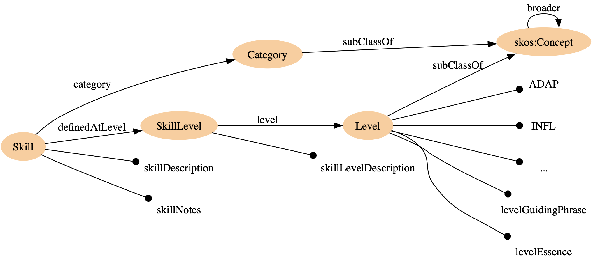

# SFIA 9 in RDF

**Note**:

SFIA (the _Skills Framework for the Information Age_, https://sfia-online.org) is a competency framework.
This work contains references to SFIA with the permission of the SFIA Foundation.
The rights to any SFIA content remain with SFIA - see [SFIA_LICENSE_NOTE](SFIA_LICENSE_NOTE) for information.

This script converts into RDF the SFIA spreadsheet provided at https://sfia-online.org/en/sfia-9/documentation .
At the same page, the output of this script (RDF in Turtle format) is also available.
However, the version is not guaranteed to be the latest one.

The conversion is based on the model below.

## Python setup

(Assuming you have `python3` (3.11 or above) on your system)

This repo uses [`poetry`](https://python-poetry.org/docs) as package manager. </br>

- Install poetry: ```curl -sSL https://install.python-poetry.org | python3 -```
- run `poetry install`

## Usage

- In `sfia_rdf/convert_sfia.py`, provide the path for SFIA_SKILLS_SHEET, SFIA_ATTRIBUTES_SHEET, SFIA_LEVELS_SHEET, as
  well as choose an OUTPUT
- run with `poetry run python3 sfia_rdf/convert_sfia.py`

The output will be an RDF Turtle file.

## The modelling

For a description of the modelling choices in converting the SFIA dataset to RDF,
see [conversion_readme.md](conversion_readme.md)

## The Model



